# ERD v1 — ABM CRM

Ngày: 2026-10-03. Phạm vi: thiết kế MVP1, roadmap MVP2–5; chưa viết migration hay thay dữ liệu.
Nguồn nghiệp vụ: [Decision pack QĐ1–QĐ14](../decisions/business-decisions-v1.md), [PRD mục 21 và 35](../source-package/sources/PRD-ABM-CRM-Revenue-Customer-Operations-v2.1.md), [thiết kế data model](../source-package/design/abm-agentic-crm-design.md). Lifecycle: [state machines v1](state-machines-v1.md).

## Quy ước chung

Mọi entity trong ERD là bảng typed có `id TEXT` (ULID, PK), `created_at TEXT`, `updated_at TEXT`; các cột chung này áp dụng cả khi khối Mermaid chỉ liệt kê cột riêng. Bảng có sửa đồng thời có `version INTEGER NOT NULL`, tăng theo command có expected version. Bảng append-only như activity, ownership_history, audit_log không sửa lịch sử. JSON lưu TEXT có schema contract cụ thể; không dùng JSON làm custom-field platform.

Thời gian lưu UTC ISO-8601; hiển thị `Asia/Ho_Chi_Minh`. INTEGER dùng cho boolean 0/1 và số đếm; giá trị tiền Deal là INTEGER đơn vị nhỏ nhất kèm currency, không dùng float. Mọi FK cùng organization; scope lấy từ actor đã xác thực, không lấy từ model. D1/SQLite: không dùng enum, UUID type, JSONB hoặc tính năng PostgreSQL. Migration sau duyệt sẽ dùng TEXT, INTEGER, FK, CHECK và index SQLite.

## MVP1

Customer 360 là view từ Account/Contact; không thêm bảng Customer. Organization là ABM nội bộ, Account là doanh nghiệp khách. Một Contact có thể gắn nhiều Account; Lead là intake, Deal tạo khi qualified. Các quan hệ tùy chọn thể hiện bằng `o|`; các quan hệ đa hình được giải thích dưới ERD, không giả vờ là FK SQL.

```mermaid
erDiagram
    organization {
        TEXT id PK
        TEXT name
        TEXT last_txn_id
        INTEGER version
    }
    department {
        TEXT id PK
        TEXT organization_id FK
        TEXT name
        TEXT last_txn_id
        INTEGER version
    }
    user {
        TEXT id PK
        TEXT organization_id FK
        TEXT department_id FK
        TEXT email
        TEXT lark_open_id
        TEXT status
        TEXT last_txn_id
        INTEGER version
    }
    team {
        TEXT id PK
        TEXT department_id FK
        TEXT name
        TEXT last_txn_id
        INTEGER version
    }
    user_team {
        TEXT id PK
        TEXT user_id FK
        TEXT team_id FK
        TEXT membership_role
        TEXT last_txn_id
        INTEGER version
    }
    role {
        TEXT id PK
        TEXT organization_id FK
        TEXT code
        TEXT last_txn_id
        INTEGER version
    }
    user_role {
        TEXT id PK
        TEXT user_id FK
        TEXT role_id FK
        TEXT scope_type
        TEXT scope_id
        TEXT last_txn_id
        INTEGER version
    }
    channel_identity {
        TEXT id PK
        TEXT namespace
        TEXT external_id
        TEXT user_id FK
        TEXT linked_at
        TEXT last_txn_id
        INTEGER version
    }
    lark_group_binding {
        TEXT id PK
        TEXT chat_id UK
        TEXT department_id FK
        TEXT status
        TEXT last_txn_id
        INTEGER version
    }
    account {
        TEXT id PK
        TEXT organization_id FK
        TEXT name
        TEXT tax_code
        TEXT status
        TEXT last_txn_id
        INTEGER version
    }
    contact {
        TEXT id PK
        TEXT organization_id FK
        TEXT display_name
        TEXT status
        TEXT last_txn_id
        INTEGER version
    }
    account_contact {
        TEXT id PK
        TEXT account_id FK
        TEXT contact_id FK
        TEXT role
        TEXT last_txn_id
        INTEGER version
    }
    contact_point {
        TEXT id PK
        TEXT contact_id FK
        TEXT type
        TEXT normalized_value
        INTEGER verified
        TEXT last_txn_id
        INTEGER version
    }
    duplicate_candidate {
        TEXT id PK
        TEXT organization_id FK
        TEXT entity_type
        TEXT left_entity_id
        TEXT right_entity_id
        TEXT evidence_json
        TEXT status
        TEXT reviewed_by_user_id FK
        TEXT last_txn_id
        INTEGER version
    }
    pipeline {
        TEXT id PK
        TEXT organization_id FK
        TEXT code
        TEXT name
        TEXT last_txn_id
        INTEGER version
    }
    stage {
        TEXT id PK
        TEXT pipeline_id FK
        TEXT code
        INTEGER sort_order
        TEXT entry_criteria_json
        TEXT exit_criteria_json
        INTEGER sla_hours
        INTEGER sla_working_days
        TEXT sla_unit
        TEXT last_txn_id
        INTEGER version
    }
    lost_reason {
        TEXT id PK
        TEXT organization_id FK
        TEXT code
        TEXT label
        INTEGER requires_note
        TEXT last_txn_id
        INTEGER version
    }
    lead {
        TEXT id PK
        TEXT organization_id FK
        TEXT department_id FK
        TEXT account_id FK
        TEXT contact_id FK
        TEXT source
        TEXT latest_source
        TEXT campaign_utm_json
        TEXT need_summary
        TEXT owner_user_id FK
        TEXT team_id FK
        TEXT stage_id FK
        TEXT status
        TEXT next_action_task_id FK
        TEXT lost_reason_id FK
        TEXT lost_note
        TEXT first_contact_at
        TEXT paused_reason
        TEXT reopen_at
        TEXT last_txn_id
        INTEGER version
    }
    deal {
        TEXT id PK
        TEXT organization_id FK
        TEXT department_id FK
        TEXT lead_id FK
        TEXT account_id FK
        TEXT contact_id FK
        TEXT owner_user_id FK
        TEXT team_id FK
        TEXT stage_id FK
        TEXT status
        TEXT next_action_task_id FK
        TEXT lost_reason_id FK
        TEXT lost_note
        INTEGER amount_minor
        TEXT currency
        TEXT stage_evidence_json
        TEXT paused_reason
        TEXT reopen_at
        TEXT last_txn_id
        INTEGER version
    }
    ownership_history {
        TEXT id PK
        TEXT organization_id FK
        TEXT entity_type
        TEXT entity_id
        TEXT from_user_id FK
        TEXT to_user_id FK
        TEXT assigned_by_user_id FK
        TEXT assigned_at
        TEXT reason
        TEXT approval_id FK
    }
    assignment {
        TEXT id PK
        TEXT organization_id FK
        TEXT entity_type
        TEXT entity_id
        TEXT user_id FK
        TEXT team_id FK
        TEXT assignment_role
        TEXT assigned_by_user_id FK
        TEXT assigned_at
        TEXT ended_at
        TEXT last_txn_id
        INTEGER version
    }
    task {
        TEXT id PK
        TEXT organization_id FK
        TEXT type
        TEXT title
        TEXT owner_user_id FK
        TEXT due_at
        TEXT status
        TEXT last_txn_id
        INTEGER version
    }
    task_link {
        TEXT id PK
        TEXT task_id FK
        TEXT entity_type
        TEXT entity_id
        TEXT last_txn_id
        INTEGER version
    }
    activity {
        TEXT id PK
        TEXT organization_id FK
        TEXT entity_type
        TEXT entity_id
        TEXT type
        TEXT actor_user_id FK
        TEXT occurred_at
        TEXT content
        TEXT source
        TEXT source_ref
    }
    approval {
        TEXT id PK
        TEXT organization_id FK
        TEXT requester_user_id FK
        TEXT action
        TEXT payload_json
        TEXT payload_hash
        TEXT target_type
        TEXT target_id
        INTEGER target_version
        TEXT status
        TEXT approver_user_id FK
        TEXT reason
        TEXT expires_at
        TEXT executed_at
        TEXT last_txn_id
        INTEGER version
    }
    audit_log {
        TEXT id PK
        TEXT organization_id FK
        TEXT initiating_user_id FK
        TEXT executing_actor
        TEXT action
        TEXT entity
        TEXT entity_id
        TEXT before_json
        TEXT after_json
        TEXT approval_id FK
        TEXT correlation_id
        TEXT source
    }
    outbox {
        TEXT id PK
        TEXT organization_id FK
        TEXT event_type
        TEXT payload_json
        TEXT idempotency_key UK
        TEXT status
        INTEGER attempts
        TEXT next_attempt_at
        TEXT provider_reference
        TEXT last_error_code
        TEXT correlation_id
        TEXT last_txn_id
        INTEGER version
    }
    idempotency_key {
        TEXT id PK
        TEXT organization_id FK
        TEXT key UK
        TEXT command
        TEXT request_hash
        TEXT result_json
        TEXT initiating_user_id FK
        TEXT last_txn_id
        INTEGER version
    }
    agent_kill_switch {
        TEXT id PK
        TEXT organization_id FK
        TEXT scope
        INTEGER enabled
        TEXT changed_by FK
        TEXT last_txn_id
        INTEGER version
    }
    notification {
        TEXT id PK
        TEXT organization_id FK
        TEXT recipient_user_id FK
        TEXT type
        TEXT channel
        TEXT payload_json
        TEXT status
        TEXT read_at
        TEXT outbox_id FK
        TEXT last_txn_id
        INTEGER version
    }
    organization ||--o{ department : contains
    organization ||--o{ user : employs
    department o|--o{ user : primary_department
    department ||--o{ team : contains
    user ||--o{ user_team : joins
    team ||--o{ user_team : has
    organization ||--o{ role : defines
    user ||--o{ user_role : receives
    role ||--o{ user_role : grants
    user ||--o{ channel_identity : links
    department ||--o{ lark_group_binding : binds
    organization ||--o{ account : scopes
    organization ||--o{ contact : scopes
    account ||--o{ account_contact : relates
    contact ||--o{ account_contact : relates
    contact ||--o{ contact_point : has
    organization ||--o{ duplicate_candidate : reviews
    organization ||--o{ pipeline : defines
    pipeline ||--o{ stage : orders
    organization ||--o{ lost_reason : defines
    department ||--o{ lead : queues
    account o|--o{ lead : receives
    contact o|--o{ lead : raises
    stage ||--o{ lead : tracks
    user o|--o{ lead : owns
    team o|--o{ lead : scopes
    task o|--o{ lead : next_action
    lead ||--o{ deal : qualifies
    department ||--o{ deal : scopes
    account o|--o{ deal : buys
    contact o|--o{ deal : main_contact
    user ||--o{ deal : owns
    team o|--o{ deal : scopes
    stage ||--o{ deal : tracks
    task o|--o{ deal : next_action
    lost_reason o|--o{ lead : explains_loss
    lost_reason o|--o{ deal : explains_loss
    organization ||--o{ ownership_history : preserves
    user o|--o{ ownership_history : receives_owner
    organization ||--o{ assignment : scopes
    user ||--o{ assignment : supports
    team o|--o{ assignment : assigned_team
    user ||--o{ task : owns
    task ||--o{ task_link : links
    user ||--o{ activity : records
    user ||--o{ approval : requests
    user o|--o{ approval : approves
    approval o|--o{ audit_log : authorizes
    user o|--o{ audit_log : initiates
    organization ||--o{ outbox : emits
    organization ||--o{ idempotency_key : deduplicates
    user ||--o{ agent_kill_switch : changes
    user ||--o{ notification : receives
    outbox o|--o{ notification : delivers
```

### Ý nghĩa và liên kết

`stage.sort_order` là cột cho thứ tự (tránh từ khóa SQL `order`). Stage QĐ1 áp dụng Lead/Deal, không có hai bộ pipeline riêng. `status` Lead là intake/active/paused/won/lost; Deal là active/paused/won/lost. Khi qualified tạo Deal và liên kết Lead trong cùng command, không đổi danh tính Contact/Account. Một Lead có thể có nhiều Deal; command phải chỉ rõ target và tránh tạo Deal trùng khi replay. Không tự đồng bộ kết quả của mọi Deal sang Lead: mỗi record active vẫn phải thỏa Next Action.

Stage Definition QĐ1 được lưu bằng JSON typed cho entry/exit; bằng chứng thực tế ở Activity và `deal.stage_evidence_json` gồm reference/version báo giá, phạm vi tư vấn, điều khoản, người quyết định, bằng chứng chốt. MVP1 giữ reference, không triển khai Proposal/Product catalog MVP2. `sla_hours=4` cho first-contact Lead mới; các stage active còn lại giữ `sla_working_days` 3/7/7/5/10/7, không đổi ngày làm việc thành giờ lịch. `sla_unit` phân biệt working_hours/working_days/none. Khung giờ 08:00–17:30 và lịch làm việc/ngày nghỉ là cấu hình; lịch cần hoàn thiện trước vận hành. Won/Lost không áp SLA active.

Task là nguồn duy nhất của Owner/Deadline của việc tiếp. `next_action_task_id` trỏ Task open/in_progress, có owner và due_at, cùng scope và có task_link tới record; owner Task có thể là người được giao hỗ trợ hợp lệ, không suy ra quyền đổi owner Lead. Không lưu deadline Next Action thứ hai trên Lead/Deal. Một Task có thể liên kết cả Lead và Deal: khi hoàn tất/hủy phải thay Next Action cho mọi record active đang trỏ tới nó trong cùng command.

`task_link`, activity, assignment, ownership_history, duplicate_candidate và approval dùng target đa hình trong danh sách typed cho phép; command kiểm target tồn tại và cùng organization. `user_role.scope_type/scope_id` dùng Own/Team/Department/Organization theo QĐ5, kiểm quyền tại backend. Assignment ghi support user và thời gian hiệu lực; owner hiện tại nằm trên Lead/Deal, lịch sử chuyển owner append-only. Owner Contact/Account là view từ Deal active gần nhất theo QĐ4, không phải quyền xem toàn bộ Account; Leader xử lý xung đột theo QĐ4, không tự chọn owner khi có nhiều kết quả ngang nhau.

`channel_identity` là danh tính nhân viên nội bộ. Namespace chứa channel instance; `user.lark_open_id` chỉ là projection tương thích để tra cứu, mapping chuẩn là channel_identity. Liên kết qua DM đã xác thực; email nhân viên không thay thế bằng chứng open_id. Contact Point loại email/phone, chuẩn hóa email/điện thoại E.164; không tự merge duplicate_candidate. `account_contact.role` phân biệt decision_maker/contact/payer/learner; beneficiary và payer cụ thể cho Order/Entitlement ở MVP2.

Activity loại call/meeting/email/note/chat; source/source_ref giữ provenance và chống xử lý lặp theo command key. Audit phân biệt initiating_user và executing_actor agent/service/user; không lưu hidden thinking, token hoặc PII không cần thiết. Audit giữ ít nhất 5 năm theo QĐ5. Notification chỉ gửi projection đúng quyền: nhóm Lark xem pipeline phòng ban; PII, hoa hồng, Lost reason chỉ DM. Outbox chứa destination/projection typed đã kiểm quyền, không gửi raw audit/payload approval ra nhóm.

## Ràng buộc và index

- UNIQUE `channel_identity(namespace, external_id)`; namespace gồm channel instance, không áp unique riêng external_id toàn hệ thống.
- UNIQUE `lark_group_binding(chat_id)`; binding active phải trỏ phòng ban cùng tổ chức.
- INDEX `contact_point(type, normalized_value)` không unique; CHECK type IN ('email','phone'), verified IN (0,1).
- UNIQUE `account(tax_code)` WHERE tax_code IS NOT NULL; chuẩn hóa tax_code, dùng NULL cho chưa có, không lưu chuỗi rỗng.
- INDEX `lead(owner_user_id, status)`; bổ sung `lead(department_id, status)` cho intake/pipeline phòng ban.
- INDEX `task(owner_user_id, status, due_at)`; due_at phải là UTC chuẩn để so sánh đúng.
- INDEX `audit_log(entity, entity_id, created_at)`; append-only, scope organization bắt buộc khi query.
- UNIQUE `outbox(idempotency_key)`; key được namespace theo organization/source/action.
- UNIQUE `idempotency_key(key)`; cùng key khác command/request_hash/actor trả conflict, cùng request trả result_json trong scope, không thực thi lại.
- CHECK cục bộ Lead/Deal active có owner_user_id và next_action_task_id; command + test kiểm Task còn hiệu lực, due_at, target link và scope vì SQLite CHECK không truy vấn liên bảng. Record intake chưa giao được phép chưa có owner/Next Action; chuyển active phải cấp đủ trong cùng command.
- CHECK Lost có lost_reason_id; command kiểm reason active cùng tổ chức và bắt buộc lost_note nếu reason Khác. Stage/status đồng bộ qua command, không thể CHECK liên bảng stage.
- UNIQUE `user_team(user_id, team_id)` và `account_contact(account_id, contact_id, role)`; cùng Contact được nhiều vai trò, không suy ra scope từ quan hệ khách hàng.
- UNIQUE `stage(pipeline_id, code)` và `stage(pipeline_id, sort_order)`; UNIQUE role(organization_id, code); CHECK version >= 1 và attempts >= 0.
- UNIQUE `task_link(task_id, entity_type, entity_id)`; INDEX assignment(entity_type, entity_id, ended_at), ownership_history(entity_type, entity_id, assigned_at), activity(entity_type, entity_id, occurred_at).
- FK bật/enforce khi triển khai SQLite; không cascade xóa audit/history. Xóa/ẩn danh chỉ Admin theo QĐ5 và không làm mất bằng chứng; retention nguồn chat/file không tự suy ra.
- `last_txn_id`: nonce per guarded command; guard/audit/outbox rows select by (id, version=expected+1, last_txn_id) so a losing or missing-row write aborts the whole batch (ADR-003, PoC phase 05). Cột áp dụng mọi bảng mutable dùng guarded command; append-only không cần nonce/version. Đây là contract dự kiến cần bằng chứng PoC, chưa coi runtime đã pass.
- Command kiểm expected version, actor, scope, kill switch và approval trước ghi; domain + audit + outbox + idempotency result ghi trong cùng guarded batch. Atomicity thực tế chờ ADR/PoC D1 phase 04–05, ERD không tuyên bố đã chứng minh runtime.

Kill switch `enabled=1` nghĩa chặn agent write tại core cho scope global/organization hoặc capability đã cấu hình, mặc định không cấp quyền ngoài scope. User web vẫn theo RBAC; bot không tự bỏ switch. Retry outbox phải giữ key/payload, lease/version chống hai dispatcher claim cùng event; không coi lease là exactly-once phía ngoài.

## Roadmap entity

| Module PRD | Bậc | Entity |
| --- | --- | --- |
| M1 Customer 360 | MVP1 | Account, Contact, AccountContact, ContactPoint, DuplicateCandidate; Customer 360 view |
| M2 Lead/Ownership | MVP1 | Lead, Assignment, OwnershipHistory, nguồn Lead typed theo QĐ12 |
| M3 Pipeline/Activity/Follow-up | MVP1 | Deal, Pipeline, Stage, LostReason, Activity, Task/TaskLink |
| M4 Product/Pricing/Knowledge | MVP2 | Product, ProductVersion, PriceList, EntitlementTemplate, KnowledgeDoc |
| M5 Proposal/Contract/Order/Payment | MVP2 | Proposal, ProposalVersion, Contract, Order, OrderLine snapshot, PaymentSchedule, PaymentReference |
| M6 Handover | MVP2 | HandoverCase, HandoverChecklist, ChangeRequest |
| M7 Program Operations | MVP3 | Program, Session, Enrollment, Resource, Reservation, ChecklistTemplate |
| M8 Entitlement | MVP2 | Entitlement, Grant, Fulfillment |
| M9 Customer Success | MVP3 | Ticket, Feedback, HealthSignal, ContactPlan |
| M10 Retention/Growth | MVP3–4 | Opportunity (renewal/upsell/cross-sell/referral) |
| M11 Omnichannel | MVP4 | Conversation, Message, Attachment |
| M12 Task/Workflow/Governance | MVP1–5 | Task, TaskLink, Approval, AuditLog, Outbox, IdempotencyKey, AgentKillSwitch, Notification (MVP1); Workflow, EventHandler, Dashboard snapshot, governance mở rộng theo ladder |

Roadmap chưa khóa cột/migration. ProductVersion/OrderLine snapshot giữ cam kết; Entitlement chống trùng theo OrderLine/template/beneficiary và điều kiện thanh toán đã xác nhận; PaymentReference trỏ MISA/import kế toán với provenance, không ghi sổ từ CRM. Handover Complete kiểm mandatory và ChangeRequest sau Complete theo QĐ7. Reservation sẽ có start/end/timezone/status và chống race theo gate MVP3. Không dùng Deal Won thay thực thu.

## Cần user duyệt

Hai tài liệu ERD và state model cần phê duyệt trước migration. Không đề xuất mở lại QĐ1–QĐ14. Retry threshold, lịch làm việc cụ thể, danh sách phòng ban/Leader và mẫu Product Master không tự điền; cấu hình và deliverables ở phase/ladder đã sở hữu chúng. Luồng skip/back stage hoặc reopen Won/Lost chưa được QĐ1 quy định; MVP1 chỉ cho các transition đã liệt kê trong state model, mở rộng cần quyết định riêng.

## Phê duyệt

Đã duyệt bởi user: ABM — 2026-10-03 [APPROVED]
