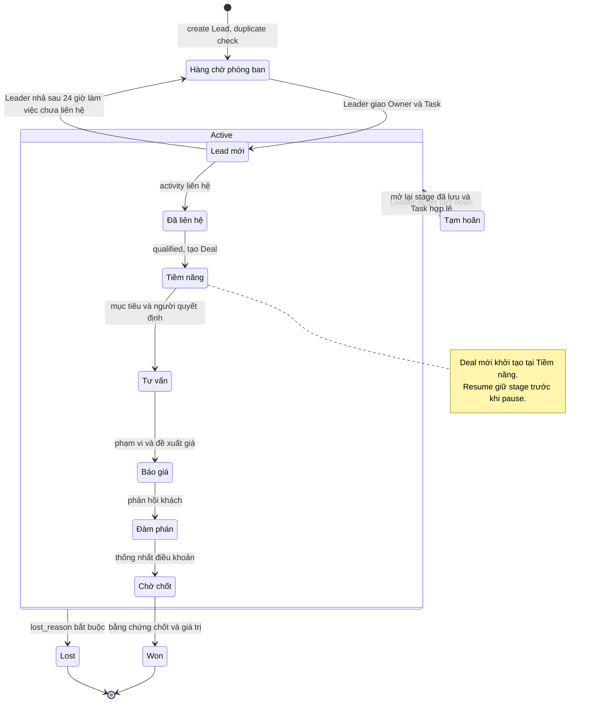
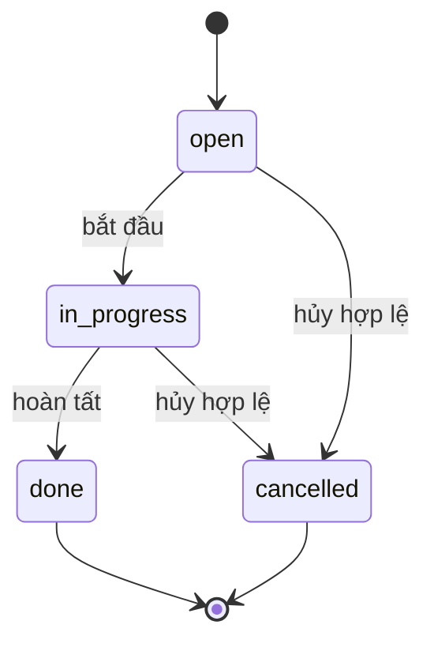
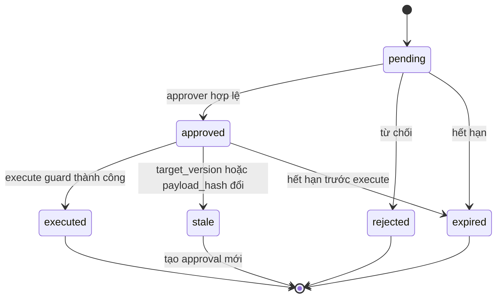
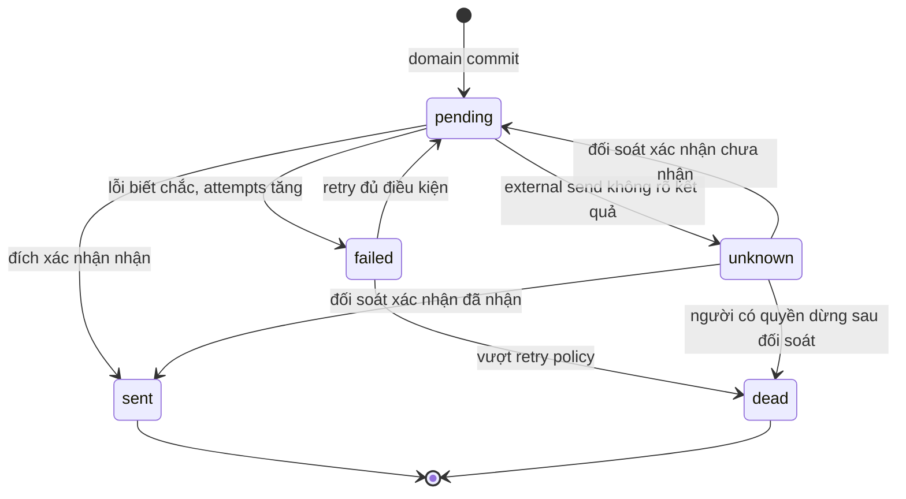

# State machines v1 — ABM CRM

Ngày: 2026-10-03. Thiết kế MVP1, user ABM đã duyệt cùng [ERD v1](erd-v1.md) qua coordinator ngày 2026-10-03.
Nguồn: [Decision pack QĐ1, QĐ4, QĐ5, QĐ13, QĐ14](../decisions/business-decisions-v1.md), [PRD 10, 19, 35](../source-package/sources/PRD-ABM-CRM-Revenue-Customer-Operations-v2.1.md), [thiết kế command/approval/outbox](../source-package/design/abm-agentic-crm-design.md).

## Quy tắc xuyên suốt

Mỗi transition là command backend dùng chung cho UI/REST/MCP, kiểm actor thật, RBAC, organization, expected version, idempotency và agent kill switch. Domain mutation, audit và outbox phải thành công cùng guarded batch; bằng chứng D1 thuộc phase 05. Không ghi audit thành công hoặc event nếu command rollback. Idempotency cùng key/payload/actor trả receipt cũ; key khác payload trả conflict.

Agent chỉ tự ghi Activity, tạo Lead đã kiểm trùng và tạo việc tiếp/nhắc trong scope. Đổi stage, Won/Lost, owner hoặc gửi ra ngoài chỉ đề xuất rồi execute sau approval hợp lệ. Người có quyền trên web vẫn cần các duyệt riêng đã chốt như Sale yêu cầu chuyển owner, Leader duyệt. Support chỉ xem/ghi hoạt động, không đổi stage. Nhóm Lark chỉ nhận pipeline phòng ban; Lost reason/PII/hoa hồng qua DM. Approval không mở rộng quyền actor.

## 1. Lead/Deal

Stage QĐ1 và `status` là hai chiều: intake chưa giao; active có Owner + Next Action + Deadline; paused có lý do/ngày mở lại được Leader duyệt; won/lost terminal. Intake chỉ áp dụng Lead. Deal bắt đầu tại Tiềm năng khi qualified, không phải intake Lead mới. Sơ đồ dùng cùng stage vocabulary cho cả hai; nhánh khởi tạo Deal được ghi bằng note và bảng.

| Từ | Sang | Ai được làm | Điều kiện | Cần duyệt? |
| --- | --- | --- | --- | --- |
| Chưa có Lead | Intake / Lead mới | User có create trong scope; agent create_lead | Nguồn QĐ12, duplicate check, department; chưa có owner không được status active | Agent create Lead intake tự làm; tạo active không được tự chọn owner |
| Intake | Active / Lead mới | Leader phòng ban | Owner/team hợp lệ, Task open/in_progress có owner/due_at và link; assignment/history/audit cùng command | Leader trực tiếp phân; agent đề xuất phải được Leader duyệt |
| Lead mới | Đã liên hệ | Owner hoặc người có quyền đổi stage trong scope | Activity liên hệ có kết quả, Next Action hợp lệ, tiêu chí QĐ1 | Agent cần duyệt |
| Đã liên hệ | Tiềm năng | Owner hoặc người có quyền đổi stage | Qualified nhu cầu; Contact/Account liên kết; tạo Deal tại Tiềm năng, Owner/Task/due_at trong cùng command; replay không tạo lặp | Agent cần duyệt |
| Tiềm năng | Tư vấn | Owner hoặc người có quyền đổi stage | Mục tiêu và người quyết định; tiêu chí entry/exit và Next Action | Agent cần duyệt |
| Tư vấn | Báo giá | Owner hoặc người có quyền đổi stage | Nội dung tư vấn, sản phẩm quan tâm, phạm vi và reference/version báo giá, giá trị đề xuất | Agent cần duyệt; gửi báo giá ra ngoài là action riêng cần duyệt |
| Báo giá | Đàm phán | Owner hoặc người có quyền đổi stage | Activity phản hồi khách, điều khoản đang trao đổi, Next Action | Agent cần duyệt |
| Đàm phán | Chờ chốt | Owner hoặc người có quyền đổi stage | Điều khoản thống nhất, giá trị dự kiến, người quyết định | Agent cần duyệt; discount vượt quyền cần duyệt riêng |
| Chờ chốt | Won | Owner hoặc người có quyền đổi stage | Bằng chứng chốt và giá trị Deal; audit; Task tiếp theo không bắt buộc cho record terminal | Agent cần duyệt; Won không xác nhận thu tiền |
| Bất kỳ stage active | Lost | Owner hoặc người có quyền đổi stage | lost_reason hợp lệ; Khác có giải thích; audit; projection nhóm không chứa reason | Agent cần duyệt |
| Active | Paused | Leader theo yêu cầu trong scope | Lý do, reopen_at UTC; không xóa stage; lưu/chỉ rõ task xử lý tiếp để không tạo khoảng trống ngoài ngoại lệ | Leader duyệt cho cả người và agent |
| Paused | Active / stage trước tạm hoãn | Leader hoặc service đã cấp capability theo policy được duyệt | Đến ngày mở lại, Owner còn hợp lệ, Task còn hiệu lực hoặc tạo thay thế cùng command; không tự tiến stage | Agent cần duyệt; auto-resume chỉ khi policy đã cấp, chưa tự bật MVP1 |
| Lead mới active chưa liên hệ | Intake | Leader phòng ban | Quá 24 giờ làm việc chưa liên hệ; nhả owner/team và kết thúc assignment hợp lệ; xử lý Task, audit/history | Leader quyết định; không tự nhả bởi cron/agent |
| Active owner A | Active owner B | Leader sau yêu cầu chuyển của Sale; Leader phân lại khi Sale nghỉ | Owner B và team/scope hợp lệ; history/assignment/audit; Task owner được xử lý rõ, không cấp quyền theo owner cũ | Leader duyệt; agent cần approval |

Mọi đổi stage tăng version và ghi audit before/after, actor/source/correlation/approval. First contact sau 4 giờ làm việc nhắc Owner và Leader; sau 24 giờ làm việc Leader quyết định nhả, không tự chuyển trạng thái. Stage SLA theo QĐ1: Đã liên hệ 3, Tiềm năng 7, Tư vấn 7, Báo giá 5, Đàm phán 10, Chờ chốt 7 ngày làm việc; giờ 08:00–17:30 Asia/Ho_Chi_Minh, cần lịch ngày làm việc/ngày nghỉ cấu hình. Không dùng elapsed UTC làm business time.

Chuyển stage Lead và Deal được kiểm riêng theo target; không tự đóng mọi Deal của cùng khách khi một Deal Won/Lost. Việc next-action chung kiểm mọi target còn active. Skip/back stage và reopen Won/Lost chưa có quyết định; chưa cho phép trong MVP1. Không tự đặt ngưỡng, stage mới hay ngoại lệ.

## 2. Task

| Từ | Sang | Ai được làm | Điều kiện | Cần duyệt? |
| --- | --- | --- | --- | --- |
| Chưa có | open | User có quyền task; agent create_next_action/nhắc | Owner, due_at và target rõ, actor/scope hợp lệ; không tự đổi owner Lead | Không cho low-risk trong scope; chuyển owner Lead là action duyệt riêng |
| open | in_progress | Task owner hoặc người có quyền task trong scope | Expected version, Task chưa terminal, quyền trên mọi target liên quan | Không cho user; agent ngoài tools tự làm MVP1 cần quyền/approval riêng |
| in_progress | done | Task owner hoặc người có quyền task | Có kết quả; Forced Next Action: nếu Task là next_action của Lead/Deal active, tạo Task mới có owner/due_at/link và đổi mọi pointer liên quan trong cùng command | User theo quyền; agent không tự hoàn tất ngoài low-risk tools đã chốt |
| open / in_progress | cancelled | Task owner hoặc người có quyền task | Có lý do; không để record active thiếu việc tiếp, tạo thay thế cùng command hoặc chuyển record terminal hợp lệ | User theo quyền; nếu đổi stage/Won/Lost thì cần approval agent riêng |

Không reopen Task terminal; tạo Task mới có provenance. Hoàn thành/hủy Next Action và tạo thay thế phải atomic: failure bất kỳ phần nào rollback tất cả. Ngoại lệ khi cùng command chuyển đúng record Won/Lost không cần Next Action mới cho record đó; các record active khác vẫn phải thay. Trường hợp paused theo QĐ13 chỉ hợp lệ nếu đã có Leader duyệt, lý do/ngày mở lại; không dùng cancel để lách Forced Next Action. Sửa due_at/owner của Task là command versioned trong scope và không tự đổi owner Lead/Deal.

## 3. Approval

| Từ | Sang | Ai được làm | Điều kiện | Cần duyệt? |
| --- | --- | --- | --- | --- |
| Chưa có | pending | Requester có quyền đề xuất; agent trong scope | Lưu action, target_type/id/version, exact payload/diff, canonical payload_hash, reason, expires_at; không chứa credential | Đây là yêu cầu duyệt, chưa execute |
| pending | approved | Approver có quyền với action/target | Chưa hết hạn; xem đúng payload/diff; target_version/hash còn khớp; actor/scope kiểm server; approver_user_id và audit | Có, người được phân quyền duyệt; agent không tự duyệt |
| pending | rejected | Approver có quyền | Reason từ chối, expected approval version và audit | Quyết định của approver |
| pending / approved | expired | Core scheduler hoặc execute guard | UTC now >= expires_at; không execute domain action | Không; enforcement expiry |
| approved | stale | Core execute guard | Current target_version khác target_version hoặc recomputed payload_hash khác; không ghi domain/outbox thành công | Không; bắt buộc proposal và approval mới |
| approved | executed | Command service dưới initiating user và executing actor đã xác thực | Recheck approver/action rights, requester/actor scope, kill switch, expiry, target version và hash; domain + approval CAS + audit + outbox + idempotency cùng guarded batch | Dùng đúng approval đã cấp; không sửa payload khi execute |

`approved` chưa có nghĩa nghiệp vụ đã đổi. Execute fail do hạ tầng rollback, giữ approved nếu version/hash/expiry vẫn hợp lệ; retry cùng key không tạo event lặp. Mất quyền/switch bật thì deny, không tự đổi payload hoặc coi executed. stale/rejected/expired terminal; bản mới giữ tham chiếu provenance tới yêu cầu cũ trong typed payload/audit, không tái dùng token approval. Hai executor cùng approval phải dùng approval version/CAS; chỉ một lần đổi executed. Approval không thay audit; payload hash phải được core tính từ canonical command, không tin hash agent gửi.

## 4. Outbox

| Từ | Sang | Ai được làm | Điều kiện | Cần duyệt? |
| --- | --- | --- | --- | --- |
| Chưa có | pending | Domain command service | Domain/audit/event/key cùng commit; payload typed, destination/projection đã kiểm quyền; outbound approval trước enqueue nếu agent gửi ngoài | Kế thừa approval action; không tạo gửi ngoài không được duyệt |
| pending | sent | Dispatcher có service capability | Claim bằng lease/version; đích xác nhận nhận, giữ provider_reference/correlation; không đồng nghĩa khách đã đọc | Không duyệt lần hai cùng action đã cấp; recheck quyền/policy/switch khi gửi agent |
| pending | failed | Dispatcher | Lỗi chắc chắn chưa gửi/không nhận, attempts tăng đúng một lần, error_code đã khử dữ liệu nhạy cảm, next_attempt_at theo retry policy | Không |
| failed | pending | Retry worker | Retryable, chưa vượt policy, đến next_attempt_at; giữ key và payload; không retry unknown | Không, action còn được phép |
| failed | dead | Retry worker | Lỗi không retryable hoặc attempts vượt ngưỡng retry policy; thông báo operator trong scope | Không; ngưỡng chưa tự đặt, cần cấu hình được duyệt trước runtime |
| pending | unknown | Dispatcher/recovery worker | Timeout/disconnect/crash sau dispatch có khả năng đích đã nhận; lưu reference và attempts của lần thử, dừng retry | Không |
| unknown | sent | Operator có quyền reconciliation | Bằng chứng provider xác nhận đã nhận; lưu audit/provenance đối soát | Đối soát thủ công |
| unknown | pending | Operator có quyền reconciliation | Bằng chứng chưa nhận; action và approval vẫn hợp lệ, giữ key; nếu payload đổi phải proposal/approval mới | Đối soát thủ công; approval mới khi action/payload/hạn không còn hợp lệ |
| unknown | dead | Operator có quyền reconciliation | Không thể kết luận hoặc quyết định dừng, ghi reason/bằng chứng, không báo gửi thành công | Quyết định thủ công trong quyền, không tự đánh dead rồi resend |

Consumer nội bộ dedupe bằng event/key; không tuyên bố exactly-once xuyên API ngoài. Claim pending và bảo vệ crash window là lease/version trong dispatch metadata; hết lease sau dispatch không đủ bằng chứng để resend, chuyển unknown đối với external send. Provider có idempotency/query-by-reference thì dùng theo contract; nếu không có, người có quyền đối soát thủ công. `sent` chỉ sau xác nhận rõ; `unknown` không được đổi failed để tự retry. Dead không có automatic replay; redrive là action riêng được kiểm quyền/approval và lưu provenance.

## Kiểm chứng khi triển khai

Command tests phải chứng minh active không mất Next Action khi complete/cancel chung nhiều target; stale write rollback domain/audit/outbox; approval hash/version/expiry/actor mismatch không execute; hai executor không nhân đôi action; unknown không resend tự động; group projection không lộ Lost reason/PII. ERD/state review không thay bằng chứng runtime ADR/PoC.

## Cần user duyệt

ERD và bốn lifecycle đã được user ABM duyệt qua coordinator ngày 2026-10-03. Không tự mở rộng stage transition hoặc tự quyết retry threshold/lịch làm việc; những cấu hình chưa đủ giữ nguyên trạng thái chờ tại deliverable sở hữu chúng.
