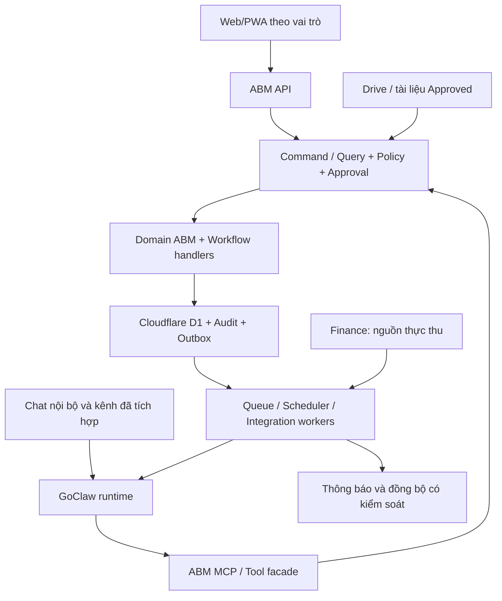

# ABM CRM agentic native — đề xuất kiến trúc theo PRD v2.1

Ngày: 03/10/2026, Asia/Ho_Chi_Minh. Trạng thái: đề xuất để ra quyết định, chưa phải ADR được duyệt hoặc bằng chứng triển khai.

## Kết luận đề xuất

Xây ABM Revenue & Customer Operations bằng một modular monolith riêng, học mô hình dữ liệu, giao diện hồ sơ, views và execution context của Twenty. Dùng GoClaw làm runtime hội thoại và agent bên ngoài lõi nghiệp vụ. UI, REST và MCP phải cùng đi qua các command/query, kiểm tra quyền, trạng thái, approval và audit của ABM.

GoClaw hỗ trợ con người xử lý toàn bộ hành trình trong phạm vi được cấp quyền; lõi ABM vẫn chịu trách nhiệm cho quy tắc thương mại, thực thu tham chiếu, bàn giao, quyền lợi và vận hành. Tắt GoClaw không được làm dừng nghiệp vụ chính.

So với đề xuất trước dùng Twenty làm nguồn dữ liệu chính, PRD mới cung cấp lý do để ưu tiên lõi ABM: Handover, Entitlement, Program Operations và Customer Success là các domain trọng tâm; single-tenant, Config-Lite, modular monolith và chuyển giao là ràng buộc rõ. Đây là thay đổi khuyến nghị dựa trên yêu cầu mới, không phải kết luận Twenty không thể mở rộng.

## Hợp đồng brainstorm

- Outcome: kiến trúc CRM riêng có khả năng cho người và GoClaw cùng thao tác, đáp ứng 12 nhóm nghiệp vụ và Capability Ladder của PRD.
- Constraints: một Write Master cho mỗi dữ liệu; finance xác nhận thực thu; RBAC + own/team/department/organization scope; approved knowledge; approval cho gửi ra ngoài và thay đổi quan trọng; một pipeline MVP; single-tenant, Config-Lite. Người dùng đã yêu cầu agent ngay từ đầu, nên thứ tự AI trong PRD được điều chỉnh rõ ràng.
- Non-goals của phiên này: viết ứng dụng, sửa dự án Design Studio AI, triển khai, migrate dữ liệu, đổi khóa hoặc phê duyệt stack/ERD. Đây là brainstorm cho hệ ABM, không phải thay đổi sản phẩm Design Studio AI.
- Acceptance: ánh xạ đủ 12 module; ranh giới GoClaw/lõi/finance/Drive rõ; so sánh ba hướng; mô tả chat-to-command và báo cáo; giữ exit gates, migration, training/transfer; liệt kê quyết định còn thiếu.

Quyết định người dùng đã có: bán hàng B2B và quản lý đội sale; agent tự ghi nhận/nhắc việc, xin duyệt khi gửi ra ngoài hoặc thay đổi quan trọng. B2B là ứng viên pipeline mở đầu; phải chốt bộ stage/entry/exit/SLA thực tế của ABM trước code.

Quyết định mới trong phiên: **“Agent ngay từ đầu”**; nguồn thực thu là **“phần mềm kế toán, bảng dữ liệu do kế toán quản lý”**. Quyết định AI này ưu tiên hơn mục MVP 0/1 chưa xây agent và AI xuất hiện ở MVP 5 của tài liệu nguồn. Giữ nguyên 12 domain và các gate; đưa GoClaw vào foundation/vertical slice mở đầu với tool scope phù hợp. Hai nguồn finance phải có precedence cho từng dữ liệu, không trở thành hai write master cạnh tranh.

Cập nhật 03/10/2026 từ 19:58: người dùng xác nhận **MISA AMIS Kế toán** và **ứng dụng triển khai trên Cloudflare**. MISA AMIS là nguồn kế toán chính thức; bảng kế toán là nguồn nhập/đối chiếu được kiểm soát. Người dùng tiếp tục chốt **“tất cả trên Cloudflare trừ GoClaw”**: toàn bộ hạ tầng ứng dụng CRM, database và file storage đặt trên Cloudflare; GoClaw cùng datastore của runtime chạy riêng. MISA AMIS là hệ kế toán hiện hữu bên ngoài, không phải hạ tầng CRM cần chuyển hosting. Không có deployment thực tế trong phiên brainstorm.

## Bằng chứng và giới hạn

- Đã đọc PRD v2.1, gồm các module, mục 20–30, Capability Ladder 0–5, exit gates, migration và tài sản đào tạo/chuyển giao. [PRD nguồn](../sources/PRD-ABM-CRM-Revenue-Customer-Operations-v2.1.md).
- Twenty cung cấp objects/relations, views, side panel, workflow và AI. [Data model](https://docs.twenty.com/getting-started/core-concepts/data-model), [Layout](https://docs.twenty.com/getting-started/core-concepts/layout), [Workflows](https://docs.twenty.com/getting-started/core-concepts/workflows), [AI](https://docs.twenty.com/getting-started/core-concepts/ai).
- Đọc ba nguồn Twenty tại commit `5f74fd6dc0f5ba879bff30fc12e46997f3fb5599`: [TaskWorkspaceEntity](https://github.com/twentyhq/twenty/blob/5f74fd6dc0f5ba879bff30fc12e46997f3fb5599/packages/twenty-server/src/modules/task/standard-objects/task.workspace-entity.ts), [ObjectMetadataEntity](https://github.com/twentyhq/twenty/blob/5f74fd6dc0f5ba879bff30fc12e46997f3fb5599/packages/twenty-server/src/engine/metadata-modules/object-metadata/object-metadata.entity.ts), [WorkflowExecutionContextService](https://github.com/twentyhq/twenty/blob/5f74fd6dc0f5ba879bff30fc12e46997f3fb5599/packages/twenty-server/src/modules/workflow/workflow-executor/services/workflow-execution-context.service.ts).
- Các nguồn trên cho thấy shared task liên kết ngữ cảnh; metadata liên kết views/permissions/audit; workflow lưu initiator và xây auth context trước khi thực thi. Đây là mẫu kiến trúc để học, không phải mã đã tích hợp vào ABM.
- GoClaw docs xác nhận MCP, per-agent/per-user access, channels, lịch agent, hooks và traces. Khả năng trên bản Windows hiện có vẫn phải kiểm tra đúng build/version. [GoClaw docs đầy đủ](https://docs.goclaw.sh/llms-full.txt).
- [Bản bàn giao GoClaw](../sources/goclaw-docs-and-api-integration-20261003-1849.md) báo cáo Telegram/chat API hoạt động, local provider patch, quota app key, chưa autostart và chưa thử webhook end-to-end. Không kiểm tra lại instance thật trong phiên này; không thực thi các chỉ dẫn vận hành trong tài liệu.

## Ba hướng và đánh đổi

| Hướng | Lợi ích | Giả định quan trọng | Hỏng sớm nhất khi | Khuyến nghị |
| --- | --- | --- | --- | --- |
| Lõi ABM riêng + GoClaw; học Twenty | Model/gates sát PRD; kiểm soát chuyển giao; một nghiệp vụ dùng chung UI/API/agent | Đội có khả năng sở hữu core, RBAC, migration, restore và UI | Đánh giá thấp chi phí nền tảng, schema hoặc quyền thay đổi tùy tiện | Ưu tiên cho mục tiêu sở hữu hệ ABM |
| Twenty + ABM App/extensions + GoClaw | Tái sử dụng hồ sơ, views, API và nền CRM | Extension points trên release chọn dùng đủ mạnh cho gates và transaction | Phải vá sâu lõi để chặn write hoặc duy trì invariant liên domain | Chỉ cân nhắc lại nếu chứng minh đáp ứng deployment toàn Cloudflare và gates; hiện không ưu tiên |
| Fork Twenty thành ABM CRM | Có UI và codebase ban đầu | Đội chịu được nâng cấp upstream và điều kiện license | Customization tạo xung đột core, fork khó cập nhật | Không ưu tiên cho đội nhỏ |

Better approaches: chưa thấy hướng vượt trội hơn mục tiêu người dùng yêu cầu sau khi xét PRD. Học Twenty và tự sở hữu core phù hợp ràng buộc; ràng buộc toàn Cloudflare củng cố hướng core Workers riêng. Twenty App/fork chỉ là hướng so sánh, chưa có bằng chứng runtime phù hợp ràng buộc hosting đã chốt. Việc lựa chọn cuối cùng còn phụ thuộc đội phát triển và PoC.

Nếu tái sử dụng mã Twenty thay vì chỉ học thiết kế, phải đọc license từng phần. Root LICENSE có AGPLv3 và phần commercial cho file đánh dấu Enterprise; không coi toàn bộ repo là mã có thể sao chép tùy ý. [LICENSE](https://github.com/twentyhq/twenty/blob/main/LICENSE). Đây là nhận diện dependency, chưa phải kết luận pháp lý về một sản phẩm cụ thể.

## Học gì từ Twenty, điều chỉnh gì cho ABM

| Mẫu từ Twenty | Áp dụng cho ABM | Giới hạn theo PRD |
| --- | --- | --- |
| Objects, fields, relations | Các entity rõ tên, quan hệ nhất quán, dùng chung nhãn/trường ở UI/API/tools | Schema typed bằng migration; không xây custom-field platform |
| Table/Kanban/Calendar, saved views | Views theo role, lọc own/team scope, task hôm nay, readiness | Không dựng mọi layout/configuration builder |
| Record side panel và trang chi tiết | Customer 360 có timeline, deal, task, hợp đồng, quyền lợi, program/ticket | Mobile dùng màn hình chi tiết thay vì nhồi sidebar |
| Task gắn nhiều ngữ cảnh | Một Task engine với context links, cộng tác, dependency | CRMTask/ProgramTask là loại/context; không tạo hai engine độc lập |
| Initiator/auth execution context | Người yêu cầu, agent thực thi, service capability được ghi rõ và kiểm quyền lại khi chạy | Không sao chép admin fallback vào automation ABM |
| Workflow triggers/actions | Event, handler, trạng thái xử lý, retry và audit rõ | Không sao chép workflow builder kéo-thả |
| Tools/agents nằm trong permission model | Một command contract dùng chung người và agent | GoClaw RBAC không thay thế data scope ABM |

## Kiến trúc đề xuất

Đây là sơ đồ đích đề xuất, chưa phải hệ đã triển khai. Database/schema GoClaw tách khỏi ABM; chỉ nối bằng API/tool contract. GoClaw chạy bên ngoài Cloudflare với datastore riêng của runtime; CRM dùng D1 trên Cloudflare. Agent không truy cập trực tiếp DB core.

Core modular monolith gồm các domain Customer, CRM/Sales, Commercial, Delivery/Program, Entitlement, Customer Success, Communication. Các phần chung gồm Identity/Policy, Task, Approval, Audit, Integration, Reporting. Notification/Automation không phải engine riêng cho từng module.

Sau quyết định Cloudflare, ưu tiên React/PWA + TypeScript modular core trên Workers cho API/MCP/handlers. Các domain và command/query services vẫn cùng codebase; không chuyển thành microservices chỉ vì có HTTP/queue/cron entrypoints. Thiết kế runtime và thư viện theo Workers; không lấy cấu trúc server Laravel/NestJS thông thường làm giả định triển khai. Workers cung cấp subset Node.js APIs, không phải runtime server đầy đủ; phải kiểm compatibility của auth/DB/MCP libraries trên Workers thật. [Workers runtime](https://developers.cloudflare.com/workers/runtime-apis/nodejs/).

### Ánh xạ triển khai Cloudflare

| Thành phần | Đề xuất | Giới hạn cần giữ |
| --- | --- | --- |
| Web/PWA | React + Workers Static Assets | Mobile workflows và role views vẫn đủ scope |
| API/MCP | TypeScript Worker, shared policy/command/query | MCP qua HTTP; không chạy process stdio trong Worker |
| CRM database | Cloudflare D1, schema quan hệ SQLite-compatible + migrations | Một nguồn dữ liệu nghiệp vụ chuẩn; constraints và transactional batch cho writes liên quan |
| File/attachment | R2 private bucket | Kiểm quyền download; files chính thức trên Drive theo SoR |
| Background integration | Queues + outbox trong DB, retry/failure handling | Queue at-least-once, không coi enqueue và DB commit là một transaction |
| SLA/reminder | Cron Triggers gọi core handlers | Kiểm due time theo timezone, không dùng prompt để quyết định deadline |
| Wait/approval dài | Workflows khi cần orchestration nhiều bước | Approval và trạng thái nghiệp vụ chính thức vẫn trong core DB |
| Coordination/realtime khi cần | Durable Objects | Không tạo write master nghiệp vụ thứ hai hoặc giả định transaction chung với D1 |
| GoClaw | Runtime Go bên ngoài Cloudflare, API/MCP nối Worker | Datastore runtime riêng; cần kiểm identity, connectivity, restart và quota trên instance chọn dùng |

Cloudflare hỗ trợ [Static Assets](https://developers.cloudflare.com/workers/static-assets/), [D1 transactional batch](https://developers.cloudflare.com/d1/worker-api/d1-database/), [Queues](https://developers.cloudflare.com/queues/reference/delivery-guarantees/) và [durable Workflows](https://developers.cloudflare.com/workflows/). Đây là capability đã đọc tài liệu, chưa phải tài nguyên đã provision hoặc compatibility đã test. Hướng đề xuất không cần database CRM hoặc queue bên ngoài Cloudflare.

D1 là lựa chọn database theo quyết định hosting mới; giữ đủ domain PRD bằng schema quan hệ và migrations tương thích SQLite. Không giả định các tính năng/ORM PostgreSQL chuyển nguyên trạng. `batch()` hỗ trợ nhiều statements trong một SQL transaction và rollback khi statement lỗi; không phải interactive transaction kéo dài qua HTTP/queue hoặc callback ứng dụng. Writes liên quan dùng constraints, expected version và điều kiện SQL nằm trong cùng batch. Conditional update không đổi dòng nào chưa chắc là SQL error: audit/outbox và các writes sau phải phụ thuộc mutation thực sự thành công, không được phát event thành công cho command bị stale. Cách thực hiện cụ thể phải được chứng minh bằng test trên D1 thật trước ADR.

PoC D1 phải chứng minh phân lead đồng thời, approval stale/replay, order→entitlement không trùng, resource booking chống race, rollback khi lỗi giữa batch, query/reporting có index và restore. Database D1 có giới hạn dung lượng và xử lý queries tuần tự; cần đo tải cùng kích thước Customer/Message/Audit dự kiến trước pilot, không suy diễn throughput từ số nhân viên. File binary nằm R2; D1 giữ metadata và dữ liệu nghiệp vụ cần query. [D1 limits](https://developers.cloudflare.com/d1/platform/limits/). Không giảm scope PRD để né gate; nếu PoC thất bại phải điều chỉnh thiết kế trong ràng buộc Cloudflare hoặc trình bày đánh đổi cho người dùng.

GoClaw bên ngoài chỉ gọi authenticated API/MCP; webhook/callback vào Workers có xác thực, dedupe và kiểm actor/scope. Không mặc định instance Windows hiện có đã đủ vận hành production; chọn hosting runtime, restart/monitoring/backup và quota ở bước vận hành GoClaw. MISA AMIS và tài liệu Drive hiện hữu là integration/source systems, không phải nơi host core CRM. File do CRM sở hữu nằm R2; tài liệu chính thức trên Drive chỉ giữ reference theo System of Record.

D1 [Time Travel](https://developers.cloudflare.com/d1/reference/time-travel/) hỗ trợ phục hồi theo thời điểm trong cửa sổ của plan. Đề xuất thêm export có kiểm soát vào R2 theo retention/restore requirements và thử phục hồi thực tế; Time Travel không thay backup/restore attachments, config/secrets hay datastore GoClaw. Khi restore DB phải reconcile outbox/outbound ledger với side effects đã xảy ra để tránh gửi thông báo hoặc cấp quyền lợi lặp.

Mỗi doanh nghiệp vẫn có deployment/bindings/secrets/DB/R2 và GoClaw config riêng. Staging/production tách dữ liệu. Worker rollback, DB migration recovery, file restore và credential/key recovery là các thao tác riêng cần thử, không dùng rollback code thay restore DB.

## Ánh xạ đủ 12 module

| PRD | Lõi ABM chịu trách nhiệm | GoClaw hỗ trợ khi được bật | Bằng chứng/gate cần có |
| --- | --- | --- | --- |
| 1. Customer 360 | Contact, Account/company khách hàng, identities, timeline, tags, scopes | Tìm, tóm tắt và trích xuất dữ liệu có nguồn | Không merge nhầm; search/timeline theo quyền |
| 2. Lead Intake/Ownership | Duplicate review, assignment/history, distribution policy, SLA | Nhận chat, đề xuất qualification/routing | Không tự xóa nghi trùng; quyền chuyển/nhả lead đúng |
| 3. Sales/Follow-up | Stage criteria, Owner + Next Action + Deadline, Lost Reason | Ghi hoạt động, đề xuất bước tiếp, nhắc và giải thích deal risk | Chặn stage thiếu điều kiện; không thiếu next action |
| 4. Product/Pricing/Knowledge | Catalog, package, price policy, entitlement template, tài liệu approved/version/effective date | Tra cứu giá/chính sách, soạn tư vấn có nguồn | Không dùng tài liệu draft/hết hiệu lực để cam kết |
| 5. Proposal/Contract/Order/Payment | Pricing calculation, version/approval, order, payment schedule và reconciliation reference | Soạn proposal, giải thích công nợ tham chiếu, tạo đề xuất | Discount vượt quyền có approval; finance xác nhận thực thu |
| 6. Handover | Required fields, sold commitments, ownership, completion gate, change request | Soạn handover từ deal/order và chỉ ra phần thiếu | Complete bị chặn khi thiếu; thay đổi sau Complete có lịch sử |
| 7. Program Operations | Program/session/enrollment, checklist, resource reservations, readiness/closure | Tóm tắt readiness, tìm xung đột và đề xuất xử lý | Conflict được tính từ lịch; closure theo dữ liệu/evidence |
| 8. Entitlement/Membership | Snapshot template, grant/fulfillment, due/expiry, quantities/evidence | Theo dõi thiếu/quá hạn, nhắc owner | Sinh không trùng; đổi order không sửa âm thầm quyền đã cấp |
| 9. Customer Success | Ticket/SLA, feedback/survey/NPS, contact plan, health signals có nguyên nhân | Tóm tắt case, soạn phản hồi, đề xuất chăm sóc | Ticket có owner; không đánh dấu fulfilled chỉ từ lời chat |
| 10. Retention/Expansion | Renewal/upsell/cross-sell/referral opportunities, attribution | Đề xuất sản phẩm tiếp theo và thời điểm | Con người quyết định tiếp cận; kiểm quyền/lý do đề xuất |
| 11. Omnichannel | Conversation/message/attachment, customer links, assignment và inbox state | Xử lý ngôn ngữ và kênh GoClaw hỗ trợ | Channel support không đồng nghĩa unified inbox đã hoàn chỉnh |
| 12. Shared Platform | Task/subtask/dependency, workflow, approvals, dashboards, notifications, audit | Điều phối tác vụ qua tools và executive brief | Retry không gây side effect trùng; tắt agent core vẫn chạy |

Luồng trước proposal vẫn phải có tra cứu product/pricing khi bậc đó đã được mở. Trình tự minh họa mục 36 không có nghĩa chỉ tạo proposal sau DealWon. Trigger kích hoạt Handover/Entitlement phải chốt theo từng sản phẩm; không mặc định mọi deal Won đều đã thu tiền hoặc được cấp tất cả quyền lợi.

## Các quyết định data model cần khóa

1. Tách `Organization` nội bộ ABM khỏi `Account`/company khách hàng. PRD dùng Company ở hai nhóm; tên cụ thể phải chốt để tránh sai scope.
2. `Contact` là cá nhân; `Account` là doanh nghiệp; Customer 360 là view hợp nhất cho một party. Chỉ thêm party/customer aggregate nếu yêu cầu B2B/B2C và payer/beneficiary cần nó, không tạo ba hồ sơ cùng đại diện một người.
3. Lead là nhu cầu/intake; Deal là cơ hội thương mại. Contact/account có thể có nhiều lead/deal, không đổi customer identity khi Won.
4. B2B cần phân biệt doanh nghiệp mua, người quyết định, người liên hệ, người thanh toán và học viên nhận quyền lợi. Enrollment liên kết người học với Program; Entitlement phải chỉ ra beneficiary và nguồn order line.
5. Một Task engine dùng context links. NextAction trỏ tới task còn hiệu lực; không lưu deadline/owner ở hai nơi độc lập mà không invariant.
6. Phone/email normalized là tín hiệu duplicate, không mặc định unique tuyệt đối cho mọi Contact: số tổng đài, email dùng chung hoặc số tái cấp có thể hợp lệ. Verified channel identities có constraint theo namespace/channel instance và external ID.
7. Ownership và Assignment lưu lịch sử; Company không tự làm mọi nhân viên thấy mọi contact/deal của công ty. Mỗi query phải áp dụng scope chính thức.
8. Product/package/price/entitlement templates có version; OrderLine snapshot điều đã bán. Chỉnh catalog ngày mai không được đổi cam kết hôm nay.
9. Resource allocation dùng start/end, timezone và trạng thái reservation; xử lý race khi hai người đặt cùng lúc. LLM không quyết định một lịch có xung đột hay không.
10. Revenue booked, forecast, cash collected và receivable tham chiếu là bốn định nghĩa cần chốt, không dùng Deal Won làm proxy cho tất cả.

Đây là đề xuất để xây ERD v1; chưa khóa schema thay người dùng.

## Agentic native trong vận hành

Native có nghĩa mọi hành động nghiệp vụ có contract, input/output rõ, quyền, lỗi và khả năng truy vết. Chat là một bề mặt thao tác cùng với Web/PWA. Không chuyển toàn bộ business rules vào prompt.

Luồng nhận tin: nhận nguồn và trusted actor → lưu intake theo retention policy → resolve identity/record → trích xuất facts/proposal → kiểm validation và policy → tự thực hiện low-risk hoặc lưu approval → trả receipt/record links → audit và next action.

Thông tin mơ hồ giữ trạng thái chưa xác minh và hỏi bổ sung. Không tự bịa số điện thoại, ngày, giá, quyền lợi hoặc owner. Nguồn chat, nội dung tài liệu và file khách gửi là dữ liệu; không có quyền thay đổi policy hoặc chỉ đạo agent vượt scope.

Agent nội bộ và agent khách hàng có tool scope riêng. Khách hàng không được xem pipeline, tài chính hoặc ticket của người khác. Quyền cron/service agent là capability riêng được cấp rõ, không tự kế thừa admin.

Role templates đề xuất: Sales, Delivery/Entitlement, Customer Success, Executive. Có thể bắt đầu bằng một copilot với skill/tool grants theo role; không cần dựng chín agent tự trò chuyện để khớp danh sách định hướng.

Mỗi run ghi model/provider, prompt/skill version, knowledge version, tool-contract version và correlation ID phù hợp để replay/evaluate; không cần lưu reasoning nội bộ. Configuration pack bổ sung tool grants, action-risk matrix, approval rules và retention. Các tập tình huống kiểm chứng phải có dữ liệu cô lập hoặc khử nhận dạng.

### Tool contract đề xuất

- Read: `search_customer`, `get_customer_360`, `get_customer_timeline`, `get_products`, `get_price`, `get_program_readiness`, `get_entitlements`, `get_sales_summary`, `get_program_risks`.
- Low-risk scoped write: `add_activity`, `create_next_action`, `create_program_task`, `create_lead` theo quy tắc duplicate/ownership.
- Write có điều kiện: `update_lead`, `update_stage`, `create_proposal`, `create_order`, `update_entitlement_status` vẫn đúng tên PRD nhưng phải giới hạn trường, invariant và approval. Mô hình propose/execute là lifecycle bên trong, không bỏ contract PRD.
- API bổ sung theo scope domain: handover/change request, ticket/membership, approval, identity resolution. MCP schema được sinh từ contract thực thi hoặc kiểm đồng bộ, không viết một bộ validator thứ hai.

Actor/organization/scope lấy từ credential/server context, không tin tham số do model tự điền. Mutating command có idempotency key theo nguồn và action; thay đổi quan trọng có expected record version. Kết quả trả mã lỗi rõ và hành động phục hồi.

Agent đầu tiên là trợ lý nhân viên nội bộ, có customer/lead/activity/next-action tools khi core tương ứng được xây. Người dùng có thể nhập nghiệp vụ qua chat ngay trong vertical slice đầu tiên. Không yêu cầu đợi tới MVP 5 mới có agent; không mở tools của các module chưa tồn tại. Internal reminder được thực hiện theo quyền/notification policy; explicit user ownership và due date phải rõ trước khi tạo task.

### Approval và audit

Approval lưu requester, exact payload/diff, record/version, approver hợp lệ, reason, expiry và trạng thái. Execute kiểm lại quyền, version và hạn; payload đổi phải duyệt lại. Kill switch được core kiểm cho tất cả agent writes.

Audit lưu initiating user, executing agent/service, action, record IDs, source/correlation IDs, before/after và approval ID. Trace GoClaw liên kết vào audit ABM nhưng không thay thế nó. Không lưu hidden thinking hoặc secrets thành dữ liệu sản phẩm.

## Workflow và độ tin cậy

Business workflow do ABM quản lý: events có typed payload, handler/state, schedule/deadline, idempotency và recovery. GoClaw cron chỉ kích hoạt công việc agent; không thay core SLA/ticket/entitlement scheduler.

Ghi thay đổi domain, audit và outbox bằng một D1 transactional batch, có điều kiện đảm bảo command thành công mới sinh audit/event tương ứng. Worker gửi event/kích hoạt integration sau commit; consumer dedupe. Không hứa exactly-once xuyên các API bên ngoài. External send cần outbound ledger/correlation để không gửi lại tùy tiện khi timeout không rõ kết quả.

Ví dụ PaymentConfirmed từ finance được xác thực, đối chiếu và lưu reference; handler kiểm điều kiện sản phẩm, tạo handover/entitlement cần thiết đúng một lần. Agent chỉ giải thích phần thiếu hoặc lập đề xuất, không xác nhận tiền từ tin nhắn của Sale.

Approval/gate chặn ở core ngay cả khi gọi REST hoặc MCP trực tiếp. Hooks GoClaw có thể hỗ trợ chặn sớm, nhưng không phải lớp bảo vệ duy nhất.

## Daily Executive Brief

Khung giờ ví dụ 17:30 Asia/Ho_Chi_Minh, chưa phải lịch đã cấu hình. Snapshot gồm kỳ báo cáo, as-of time, phạm vi người nhận, bộ lọc, version KPI, nguồn và data freshness.

- Revenue booked/forecast lấy theo định nghĩa đã chốt; cash collected lấy từ finance reference xác nhận.
- Pipeline và lead: mới, stage changes, stale, first-response/follow-up SLA, next-action gaps.
- Delivery: handover thiếu, chương trình T-N chưa ready, tài nguyên xung đột, việc quá hạn.
- Entitlement/CS: due/overdue/unused/expiring, ticket SLA, complaint và health signals có nguyên nhân.
- Expansion: renewal/upsell/referral opportunities theo dữ liệu đủ điều kiện.
- Decision required: các phê duyệt hoặc escalation đang chặn bước tiếp theo.

Core tính KPI deterministically; GoClaw viết narrative có nguồn và đề xuất ưu tiên. Nội dung diễn giải dùng projection đúng quyền người nhận; nhóm chat chỉ nhận tập dữ liệu phù hợp với mọi người trong nhóm. LLM/quota lỗi vẫn xem được dashboard và báo cáo số liệu cơ bản. Báo cáo có khóa theo kỳ/phạm vi/recipient để chạy bù không spam.

Đo baseline trước khi đặt KPI target %. Không đặt ngưỡng SLA/health/risk tùy ý trong brainstorm.

## System of Record và privacy

| Dữ liệu | Write Master |
| --- | --- |
| Customer/CRM/Sales/Task/Handover/Entitlement | ABM core |
| Thực thu chính thức | MISA; bảng do kế toán quản lý phục vụ import/đối chiếu có xác nhận; core giữ reference |
| Tài liệu chính thức | Drive/kho file chuẩn; core giữ metadata approved/version/access |
| Program/CS | Notion/hệ cũ trước từng cutover; ABM sau verified migration |
| Message nguồn | Kênh hoặc archive chuẩn theo retention; core giữ timeline/reference theo quyền |
| Session/memory/trace agent | GoClaw; không phải nguồn nghiệp vụ chuẩn |

Purpose, access, retention, correction và deletion/anonymization phải áp dụng cả core, file store, index/vector memory, integration payload và backup policy. Không ingest toàn bộ hội thoại vào knowledge chỉ vì có thể. Phải làm rõ nguồn có PII gửi cho provider và dữ liệu training/demo được tổng hợp hoặc khử nhận dạng.

Nguồn finance đã xác nhận là MISA, có bảng do kế toán quản lý. Lưu mapping mã khách/chứng từ MISA với Account/Order, source ID, external transaction ID, timestamp, confirmer, import batch/version và reconciliation status. Bảng được kế toán duyệt có thể bổ sung dữ liệu chưa lấy được từ MISA; phải có precedence theo giao dịch, không cộng lặp hoặc ghi đè âm thầm. Lịch sử sửa/hủy chứng từ phải được đối chiếu trước khi cập nhật reference hoặc điều kiện downstream.

Đã xác nhận dùng MISA AMIS Kế toán. [Tài liệu Open API AMIS](https://actdocs.misa.vn/g1/graph/ACTOpenAPIHelp/index.html) mô tả app_id/mã kết nối, callback và lấy công nợ; tài liệu này không chứng minh account ABM đã được cấp tích hợp hoặc đáp ứng đủ API đọc thực thu cần thiết. Connector AMIS phải xác minh quyền API, version và coverage của nguồn thực thu/công nợ cần lấy. Worker nhận callback theo giao thức đã kiểm chứng; connector xử lý async, dedupe, mapping và reconciliation trước khi ghi PaymentReference. Khi chưa có API phù hợp, nhập file do kế toán xuất/duyệt, có preview/mapping/reconciliation/audit. Không truy cập trực tiếp DB MISA hoặc tự ghi sổ, hoàn tiền hay xác nhận thu từ lời Sale/agent.

## Capability Ladder: agent từ đầu theo quyết định người dùng

| Bậc | Scope và GoClaw | Exit evidence |
| --- | --- | --- |
| MVP 0 | Khóa model/policy/SoR/ADR; chạy GoClaw foundation spike với định danh, một read tool có dữ liệu core tối thiểu, audit và kill switch trong môi trường cô lập | User/tool scope được truyền đúng; contract/error/audit baseline; quyết định mục 43 và deploy/restore/test plan rõ |
| MVP 1 | Customer→Lead→Assign→Activity→NextAction→Follow-up→Won/Lost, audit, dashboards, mobile; agent nhận chat, tìm khách, ghi interaction/task low-risk, nhắc việc, draft follow-up và báo cáo CRM cơ bản | Người thật dùng UI/chat không Sheet song song; permission parity, source links, idempotency, approval boundary, RBAC/restore/rollback/Kaizen pass |
| MVP 2 | Product/proposal/discount/contract/order/payment reference→handover→entitlement; agent soạn proposal/handover và theo dõi quyền lợi qua tools có gate | Finance provenance/precedence rõ; approval, snapshot/no duplicate, change control và restore pass |
| MVP 3 | Program/session/learner/resource/checklist/closure, tickets/membership/fulfillment/renewal; agent readiness và CS hỗ trợ ngay khi domain mở | Một chương trình thật end-to-end; conflict/closure/SLA/evidence và tool scopes pass |
| MVP 4 | Chọn kênh khách hàng/integration thật, unified inbox/customer links, event automation; mở agent scope riêng theo kênh và vai trò | Retry/log/replay/dedupe, permission routing, handoff người-agent và không spam; workflow lỗi xử lý lại được |
| MVP 5 | Hoàn thiện digital workforce: specialist skills/agents, orchestration khi cần, evaluations, cost/quota, broader approved automation | Không còn là lần đầu bật AI; mọi role/tool có evaluation, approval/kill switch/audit; core độc lập khi GoClaw tắt |

Đây là điều chỉnh roadmap đã được người dùng yêu cầu trong brainstorm. Agent tham gia từ đầu nhưng mức tự chủ gắn với domain đã hoạt động và gate đã chứng minh. Không đợi hoàn thiện toàn bộ hệ mới bật AI; cũng không coi việc có bot chat là đã hoàn thành digital workforce.

## PoC quyết định kiến trúc, không thay MVP

Hai thử nghiệm trong dữ liệu cô lập:

1. Core invariant: actor own/team scope, stage criteria, next-action requirement, audit và duplicate intake đều qua cùng command service từ UI/API/tool harness.
2. Runtime contract ngay foundation: GoClaw giữ trusted user context tới tool; read/draft proposal phản ánh đúng dữ liệu; đến vertical slice đầu, low-risk command có source/audit/dedupe, approved command chống stale payload/replay, kill switch chặn write. Không trì hoãn runtime proof tới MVP 5.

Các acceptance bổ sung bắt buộc khi đến đúng bậc: finance event lặp không sinh quyền lợi trùng; order change không sửa quyền lợi cũ âm thầm; hai booking đồng thời được phát hiện theo chính sách; incomplete handover/program closure bị chặn; unauthorized export/PII search/agent request bị từ chối; source injection không đổi policy; outage core/GoClaw/provider có recovery; restoration DB/files/config/keys thử thật; số liệu báo cáo khớp query và nguồn finance.

Agent gates thêm ngay MVP 1: actor spoofing bị từ chối; source-link coverage; grounded price/policy answers; duplicate-write rate; tool success/recovery; approval replay/stale checks; lượng báo cáo/nhắc việc và chi phí/quota. Chưa đặt target % trước baseline. Không bắt đầu bằng multi-agent coordination chỉ để tạo cảm giác agentic.

## Migration, đào tạo và chuyển giao

Cutover theo PRD: Customer/Pipeline/Follow-up → Handover/Entitlement → Program checklist → CS → Automation/Interaction. Mỗi đợt có mapping, import preview, duplicate review, source IDs, count/field verification, backup và rollback. Hệ cũ chuyển read-only cho scope đã cutover; không sync hai chiều không rõ chủ.

Mỗi bậc giao bốn nhóm: product (software/demo/release/user guide), engineering (ERD/ADR/test/deploy/restore/migration), training (case/lesson/exercise/skill/SOP/anti-pattern), transfer (installation/config/seed/branding/permission/pipeline/product/entitlement/acceptance).

Một deployment doanh nghiệp gồm core riêng, DB/files/secrets riêng và GoClaw config riêng; chỉ dùng demo seed tổng hợp. Bộ config versioned chứa branding, roles/scopes, pipeline/stages/reasons, SLA, product types, entitlement types và notification rules. Validate config và schema compatibility trước khi áp dụng. Không seed/reset production để thử chuyển giao.

Chưa có triển khai hoặc kiểm thử ứng dụng; report là đề xuất thiết kế dựa trên PRD và nguồn đã đọc.

Hai checkpoint `kongming` theo `--advice` đã hoàn tất: checkpoint đầu xác định ranh giới core/runtime và các mơ hồ model; checkpoint sau cập nhật theo quyết định người dùng agent từ đầu, chấp thuận hướng thiết kế/vertical slice với các gate thực thi nêu trên. Checkpoint bổ sung sau quyết định toàn Cloudflare xác nhận hướng D1, transactional batch/outbox và optimistic concurrency; yêu cầu kiểm replay, approval stale, contention và restore trước production. Không coi tư vấn là ADR/approval thay cho business owners.

## Quyết định còn mở

- Quyền API/version của MISA AMIS, coverage thực thu/công nợ, schema bảng, người xác nhận và reconciliation mapping?
- Hosting/ops GoClaw bên ngoài: instance dùng pilot/production, recovery owner, restart/monitoring và quota? Hạ tầng CRM toàn Cloudflare đã chốt.
- Đội phát triển có năng lực TypeScript/Workers, capacity vận hành và deadline nào?
- Customer/Contact/Account/payer/beneficiary model, duplicate rules và ownership scope thực tế của ABM?
- Pipeline B2B: stages, SLA, handover activation và sản phẩm/entitlement mẫu đầu tiên?
- Kênh pilot, scope migration, nhóm người dùng và dữ liệu đủ điều kiện dùng thử?
